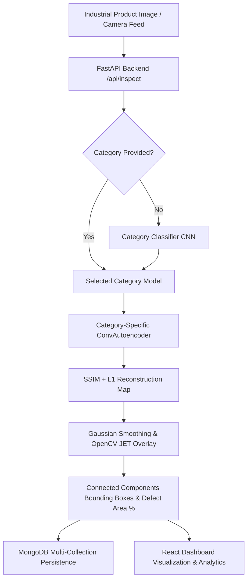

# Self-Supervised Anomaly Detection for Industrial Visual Inspection

[](https://www.python.org/)
[](https://www.tensorflow.org/)
[](https://fastapi.tiangolo.com/)
[](https://react.dev/)
[](https://www.docker.com/)
[](https://kubernetes.io/)
[](LICENSE)

An enterprise-grade, end-to-end industrial visual anomaly detection system trained on the **Visual Anomaly (VisA)** dataset. The system employs **self-supervised / unsupervised representation learning** (ConvAutoencoders with SSIM + L1 reconstruction loss) to learn normal product appearance and detect unseen industrial defects, localize anomalies, compute anomaly heatmaps, persist metrics in MongoDB, and display live diagnostics on a modern React dashboard.

---

## 🌟 Key Features

- **12 VisA Object Categories Supported**: `candle`, `capsules`, `cashew`, `chewinggum`, `fryum`, `macaroni1`, `macaroni2`, `pcb1`, `pcb2`, `pcb3`, `pcb4`, and `pipe_fryum`.
- **Self-Supervised / Unsupervised Normality Learning**: Models are trained exclusively on normal product samples without requiring prior defect labels.
- **Combined SSIM + L1 Loss Function**: Custom Keras 3 loss weighting structural similarity (SSIM) and pixel-level L1 error ($\mathcal{L} = 0.5 \cdot (1 - \text{SSIM}) + 0.5 \cdot \text{L1}$).
- **Automatic Category Classification & Auto-Routing**: Lightweight 12-class CNN classifier routes uploaded product images to their category-specific anomaly autoencoder automatically.
- **Precision Anomaly Localization & Heatmaps**: Blurs reconstruction error maps with Gaussian kernels and applies OpenCV JET colormapping over input images to pinpoint defect boundaries and bounding boxes.
- **FastAPI REST Backend**: High-performance asynchronous backend providing file upload inspection, paginated history, KPI statistics, defective product queries, model metadata, and OpenCV MJPEG camera streaming.
- **MongoDB Persistence Layer**: Multi-collection storage schema (`inspections`, `products`, `defects`, `model_versions`) with automatic fallback to in-memory caching when MongoDB is unreachable.
- **Modern React Dashboard**: Built with Vite, Tailwind CSS, and Recharts, featuring real-time inspection, interactive anomaly sliders, historical telemetry, defect analytics, and camera controls.
- **Production Containerization & Orchestration**: Complete multi-stage Dockerfiles, `docker-compose.yml`, and 11 Kubernetes production manifests (`Deployment`, `Service`, `PV`, `PVC`, `Ingress`).

---

## 📐 System Architecture



---

## 📊 Dataset & Empirical Benchmark Metrics

### Visual Anomaly (VisA) Dataset Overview
The project is benchmarked on the official [Visual Anomaly (VisA) Dataset](https://registry.opendata.aws/visa/):
- **Total Images**: 10,821 high-resolution images
- **Normal Images**: 9,621
- **Anomalous Images**: 1,200
- **Structure**: 12 object categories categorized into single objects, complex objects, and multiple objects.

### Evaluation Performance Metrics
Evaluated on full anomaly test sets using structural anomaly heatmaps:

| Metric | Empirical Score | Description |
| :--- | :--- | :--- |
| **Overall Image AUROC** | **0.7639** | Area Under ROC curve for image-level defect classification |
| **Pixel AUROC** | **0.7190** | Area Under ROC curve for pixel-level anomaly localization |
| **Anomaly Recall** | **1.0000** | 100% detection rate on true anomalous product samples |

---

## 🗂️ Project Directory Structure

```
IndustryInspectionAI/
├── ml/                         # Machine Learning Pipeline (TensorFlow/Keras)
│   ├── configs/                # Dataset & hyperparameter JSON configurations
│   ├── datasets/               # VisA dataset loader & preprocessing scripts
│   ├── models/                 # ConvAutoencoder, SSIM+L1 Loss, Category Classifier
│   ├── training/               # Multi-category training loops & weight persistence
│   ├── inference/              # AnomalyDetector & heatmap localization engine
│   ├── visualization/          # JET heatmap generator & overlay utilities
│   ├── saved_models/           # Category weight checkpoints (.weights.h5) & classifier
│   └── evaluate_phase3.py      # Quantitative evaluation benchmark suite
├── backend/                    # FastAPI REST API Application
│   ├── app/
│   │   ├── api/                # REST endpoints (/inspect, /inspections, /defects, /camera)
│   │   ├── database/           # MongoDB manager & repository layer
│   │   ├── schemas/            # Pydantic data contract models
│   │   ├── services/           # Inspection & MJPEG camera stream services
│   │   └── main.py             # FastAPI entrypoint & static mounts
│   └── Dockerfile              # Production Python 3.11 Dockerfile with OpenCV headless
├── frontend/                   # React 18 SPA Frontend (Vite + Tailwind CSS)
│   ├── src/
│   │   ├── components/         # Navbar, KPI Cards, Status Badges
│   │   ├── pages/              # Dashboard, Inspect, History, Analytics
│   │   └── services/           # Axios REST API client
│   ├── nginx.conf              # Production Nginx reverse proxy configuration
│   └── Dockerfile              # Multi-stage Nginx build Dockerfile
├── k8s/                        # Kubernetes Deployment Manifests
│   ├── mongodb/                # PV, PVC, Service, Deployment
│   ├── backend/                # Service, Deployment (Port 8000)
│   ├── frontend/               # Service, Deployment (Port 80)
│   └── ingress/                # Nginx Ingress Controller Routing
├── tests/                      # Automated Pytest Suite
│   ├── test_backend.py         # Endpoints & payload validation
│   ├── test_mongodb.py         # MongoDB CRUD operations
│   └── test_k8s_manifests.py   # YAML manifest validation
├── docker-compose.yml          # Local multi-container orchestration
└── README.md                   # Project Documentation
```

---

## 🚀 Quickstart Guide

### 1. Prerequisites
- Python 3.11+
- Node.js 18+ and npm
- Docker & Docker Compose (optional for containerized setup)

### 2. Local Python Environment Setup
```bash
# Clone repository
git clone https://github.com/Tanuja-chennurkar/Jobtracker.git
cd IndustryInspectionAI

# Create and activate virtual environment
python -m venv venv
# On Windows:
venv\Scripts\activate
# On Linux/macOS:
source venv/bin/activate

# Install backend ML dependencies
pip install -r backend/requirements.txt
```

### 3. Dataset Download & ML Pipeline Execution
```bash
# Download and structure VisA dataset
python ml/datasets/prepare_dataset.py

# Train ConvAutoencoders across all 12 VisA categories
python ml/train_phase2.py

# Train Category Classifier CNN
python ml/train_classifier_phase4.py

# Run Quantitative Evaluation Benchmark
python ml/evaluate_phase3.py
```

### 4. Running REST Backend & React Frontend Locally
```bash
# Terminal 1: Start FastAPI Backend (Port 8000)
uvicorn backend.app.main:app --host 0.0.0.0 --port 8000 --reload

# Terminal 2: Start React Frontend (Port 3000)
cd frontend
npm install
npm run dev
```
Open your browser at `http://localhost:3000` to access the React Inspection Dashboard.

---

## 🐳 Container Deployment (Docker Compose)

Launch the entire stack (FastAPI Backend, React Dashboard, MongoDB Database) with a single command:

```bash
docker-compose up --build -d
```

- **React Dashboard**: [http://localhost:3000](http://localhost:3000)
- **FastAPI OpenAPI Swagger Docs**: [http://localhost:8000/docs](http://localhost:8000/docs)
- **MongoDB Connection**: `mongodb://localhost:27017/industrial_inspection`

---

## ☸️ Kubernetes Deployment

Deploy to any Kubernetes cluster (Minikube, K3s, EKS, GKE, AKS):

```bash
# Apply all K8s manifests
kubectl apply -f k8s/mongodb/
kubectl apply -f k8s/backend/
kubectl apply -f k8s/frontend/
kubectl apply -f k8s/ingress/

# Monitor deployment rollout
kubectl get pods -w
```

---

## 🔌 REST API Endpoints

| Method | Endpoint | Description |
| :--- | :--- | :--- |
| `POST` | `/api/inspect` | Upload product image for automatic category classification, anomaly scoring, and localization |
| `GET` | `/api/inspections` | Retrieve paginated inspection history (supports filtering by `category` and `status`) |
| `GET` | `/api/inspections/{id}` | Fetch full details and localization bounding boxes for a specific inspection |
| `GET` | `/api/statistics` | Aggregate telemetry (total inspections, defect rate %, category breakdown) |
| `GET` | `/api/defects` | Query recent anomalous inspection records |
| `GET` | `/api/models` | List active Keras model versions, thresholds, and input shapes across 12 categories |
| `GET` | `/api/health` | System health check endpoint |
| `GET` | `/api/camera/stream` | Live MJPEG camera stream with inline anomaly overlay |

---

## 🧪 Automated Testing

Run the full automated test suite using `pytest`:

```bash
pytest -v
```

Tests cover:
- FastAPI REST API response contracts and error handling
- MongoDB persistence and schema mapping fallback
- Kubernetes YAML manifest syntax and port compliance

---

## 📜 Citation & License

### VisA Dataset Citation
```bibtex
@inproceedings{zou2022spot,
  title={Spot-the-difference self-supervised pre-training for anomaly detection and segmentation},
  author={Zou, Yang and Li, Jeongwan and Cao, Chentao and Zhang, Ji and Wu, Yan and Zhao, Dong},
  booktitle={European Conference on Computer Vision (ECCV)},
  pages={392--408},
  year={2022}
}
```

### License
Distributed under the **Apache 2.0 License**. See `LICENSE` for details.
